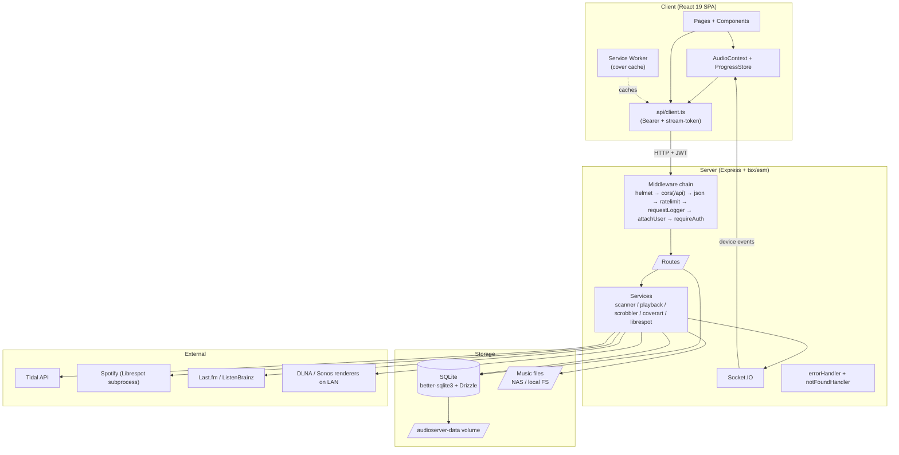

# Architecture

High-level overview of how the AudioServer pieces fit together. See the
[README](../README.md) for a feature-list and quick start; this document
focuses on the data flow.

## System diagram



## Request lifecycle (typical /api call)

```mermaid
sequenceDiagram
  participant B as Browser
  participant SW as Service Worker
  participant E as Express
  participant H as Route handler
  participant D as SQLite
  participant S as Socket.IO

  B->>SW: GET /api/library/albums?page=1
  SW->>E: Forward (network-first)
  E->>E: helmet → cors(/api) → json → rate-limit → requestLogger
  E->>E: attachUser (parse JWT)
  E->>E: requireAuth (skip non-/api; allow public paths)
  E->>H: Route matches /library/albums
  H->>D: SELECT id, title, ... FROM albums LIMIT ? OFFSET ?
  D-->>H: rows
  H-->>B: 200 { data, meta }
  Note over S: Socket.IO is separate;<br/>device updates push state to subscribed clients
```

## Module ownership

### `server/src/`

| Folder              | Purpose                                                                                                                                                                                                                                         |
| ------------------- | ----------------------------------------------------------------------------------------------------------------------------------------------------------------------------------------------------------------------------------------------- |
| `config.ts`         | zod-validated env loading. Fails fast on missing/weak `JWT_SECRET` in prod.                                                                                                                                                                     |
| `db/`               | Drizzle schema + sqlite init. Lightweight `runMigration()` helper for column adds on existing DBs.                                                                                                                                              |
| `middleware/`       | `auth.ts` (attachUser + requireAuth + signed stream tokens), `errorHandler.ts`, `rateLimiter.ts`, `requestLogger.ts`.                                                                                                                           |
| `routes/`           | One file per `/api/<area>` namespace. Each route uses `validate({ body })` from `utils/validate.ts` for inputs.                                                                                                                                 |
| `services/`         | Long-lived singletons: `scanner` (library walker), `playback` (queue + state machine), `scrobbler` (Last.fm/ListenBrainz queue with retry), `coverart` / `coverart-fetch`, `device-monitor` (DLNA discovery), `librespot` (subprocess manager). |
| `providers/`        | `MusicProvider` implementations: `local`, `tidal`, `spotify`, `qobuz` (disabled). The registry exposes `getActiveProviders()` for merged search.                                                                                                |
| `socketio.ts`       | WebSocket init + namespacing for device + scan progress events.                                                                                                                                                                                 |
| `utils/validate.ts` | zod request validation middleware.                                                                                                                                                                                                              |

### `client/src/`

| Folder                     | Purpose                                                                                                                                                              |
| -------------------------- | -------------------------------------------------------------------------------------------------------------------------------------------------------------------- |
| `api/client.ts`            | Single `fetchApi` wrapper that attaches Bearer + handles `ApiError`. Plus stream-token cache for ``/`<audio>` URLs.                                             |
| `context/AudioContext.tsx` | Playback orchestrator. Currently centralised; `currentTime/duration` was split out to `ProgressStore.ts` to avoid re-rendering the whole tree on every `timeupdate`. |
| `hooks/useAudio.ts`        | Web Audio chain + crossfade + ReplayGain. Only attaches `createMediaElementSource` for same-origin URLs (CORS would silence cross-origin streams).                   |
| `hooks/useInfiniteLoad.ts` | Paginated list state + `useAutoLoadMore` (IntersectionObserver).                                                                                                     |
| `hooks/useSocket.ts`       | Socket.IO client + device-event distribution.                                                                                                                        |
| `pages/`                   | Route-level components. Lazy-loaded via `React.lazy`.                                                                                                                |
| `components/`              | Shared UI: NowPlayingBar / NowPlayingFull, AlbumCover, ErrorBoundary, Toast, DeviceSelector, SortableList.                                                           |
| `public/sw.js`             | Service worker: network-first for shell, cache-first for covers (with `?t=` token stripped from cache keys).                                                         |

### `shared/src/`

Type-only package. `Track`, `Album`, `Artist`, `Playlist`, `NowPlaying`,
`MusicProvider`, `DeviceController`. Resolved by the client via Vite `paths`
alias to source (no dist build required at consumer time).

## Key design decisions

**Provider pattern.** Every music source implements `MusicProvider`
(`shared/src/provider.ts`). The registry's `searchAll()` fans out to all
authenticated providers in parallel and merges results with a priority order
(local > qobuz > tidal > spotify).

**Device pattern.** Every output target implements `DeviceController`
(`shared/src/device.ts`). Currently DLNA / Sonos. `playbackService` routes
play/pause/seek to the controller for the selected device, or to the browser
audio element directly.

**One playback session (V03).** `services/playback.ts` owns the household
queue; every client mirrors it. The contract, enforced by
`routes/playback.ts` and asserted in `__tests__/playback.test.ts`:

- A queue ITEM (`itemId`) is one occurrence of a track. Position, remove,
  move, "play this one", restart recovery and every event use item ids, so
  A → B → A → C plays four positions instead of jumping back to the first A.
- Every mutation bumps a `revision` (persisted in `playback_state`). Commands
  answer with the full snapshot (`GET /api/playback/session` gives the same);
  `expectedRevision` on remove/move turns an edit against an outdated view
  into `409 StaleRevision` + the fresh snapshot; `commandId` makes retries
  idempotent (same id → same result, applied once).
- Mutations require the `X-Client-Id` header (a per-tab id from the SPA).
  A page without it is from before this protocol and gets `426` ("reload")
  instead of silently overwriting the queue.
- Events (`playback:snapshot` on connect and on `playback:sync`,
  `playback:queue`, `playback:state`, `playback:track-changed`) carry the
  revision and the `origin` (client id + session, or `server`). A tab acts on
  the responses of its own commands, mirrors everything from other tabs
  without starting audio, and starts a track from a server-side advance only
  when it is the controlling tab and the NAS cannot stream that track itself
  (provider tracks).
- `/queue/clear` drops the upcoming items and lets the current track finish;
  `/stop` stops now and keeps the queue.
- The device monitor only writes transport state for the session's active
  device; other monitored speakers only feed the UI.
- `playback.ts` imports neither Socket.IO nor device code: the server is
  injected as an event sink (`setEventSink`) and device dispatch via hooks,
  so the module loads in any import order (`__tests__/playback-imports.test.ts`).

**Server-driven playback (V04).** For DLNA/Sonos/Volumio the NAS itself
plays the queue (`services/server-player.ts`), so albums continue while every
tablet sleeps:

- `services/playback-resolver.ts` is the one place that knows what each
  source can do (`GET /api/playback/capabilities`): local files → LAN url
  with a fresh `system` stream token; Qobuz → freshly signed CDN url per
  play; radio → station url; Spotify → external player only (SDK/Connect);
  Tidal → no full playback.
- `dispatch()` resolves, hands the url to the renderer with a timeout,
  retries once with a _new_ url (an expired Qobuz url is replaced, not
  retried) and records the outcome as `snapshot.dispatch`
  (`loading` → `playing` | `client` | `skipped` | `error`), pushed as
  `playback:dispatch`. The UI shows skips and errors as toasts.
- Unplayable policy (`PLAYBACK_UNPLAYABLE_POLICY`): `skip` (default) moves
  on, at most 3 in a row, then stops with an error; `stop` stops at once.
  Spotify on a speaker is left to the controlling tab when one is connected,
  otherwise it counts as unplayable.
- Ownership (`owner_user_id`, `server_managed`) is persisted. After a
  restart `reconcileAfterRestart()` asks the speaker: still playing → keep
  driving it; idle → session stopped with a visible reason; only
  `PLAYBACK_RESUME_ON_RESTART=true` re-sends the current item.
- The device monitor never overlaps polls of one device, times a status
  request out at 5 s, and when a pinned device stays unreachable it tells the
  server player, which stops the session instead of keeping a fictitious
  "playing".

**Auth surface.** Three hooks: `attachUser` (always-on, never fails —
resolves the Bearer token to a revocable session row and populates
`req.userId` / `req.sessionId` / `req.userRole`), `requireAuth` (gates every
`/api/*` path except setup-status, login/logout/register, `/auth/me`, the
health probes, the OpenAPI document and the CSP report sink; there is no
zero-users bypass, the first admin is created with a setup code) and
`requireAdmin` for household-wide mutations (see `docs/permissions.md`).
Signed stream tokens cover the ``/`<audio>` flow where the browser can't
send Authorization headers; they are bound to a session (or to the server
itself for device playback) and die with it. Helmet sends a
`Content-Security-Policy-Report-Only` header; violations land in the log via
`POST /api/csp-report`.

**SQLite + WAL.** Single-process app; better-sqlite3 in WAL mode is fast
enough for 10k+ tracks without a separate DB process. Drizzle ORM for typed
queries; raw SQL where pagination / aggregates need it.

**ESM end-to-end.** All workspaces `"type": "module"`. Server runs via
`node --import tsx/esm server/src/index.ts` — TS on-the-fly, no separate
build step in production.

**Web Audio for ReplayGain.** Opt-in: only active when the user picks a
non-`off` mode in Settings. The chain bypasses `<audio>.volume` and routes
through a `GainNode`. Cross-origin sources (Tidal/Spotify CDNs) skip the
chain because `MediaElementSource` outputs zeros without CORS headers.

## Deployment shapes

| Where                      | How                                                                                |
| -------------------------- | ---------------------------------------------------------------------------------- |
| Local dev                  | `npm run dev` (concurrently runs server + vite dev)                                |
| Production (single host)   | `docker compose up -d --build` — multi-stage build, ~300 MB image                  |
| Synology Container Manager | Same as production; bind `/volume1/music` read-only and a `data` volume for the DB |
| CI                         | GitHub Actions: lint → typecheck → tests → build. No image push (yet).             |

## Open architectural questions

These don't have a fixed answer yet and the codebase has placeholders:

- **Multi-room sync.** Currently each device plays independently. Roon-style
  zone groups (multiple devices with sub-250ms drift) would need an
  NTP-style sync model — likely a master-leader + corrections via
  Socket.IO timestamps.
- **MusicBrainz enrichment.** Per-album lookup for MBID + genre + label.
  Background queue with 1 req/s rate limit (MB policy).
- **Spotify Web API OAuth on HTTP LAN.** Blocked by Spotify's April 2025
  policy — they only accept HTTPS redirect URIs (or `localhost`). Workaround:
  reverse-proxy with TLS (Synology DSM has a Let's Encrypt integration).
- **OpenAPI spec.** Could be auto-generated from the existing zod schemas
  via `@asteasolutions/zod-to-openapi`. Would publish `/api/docs` as Swagger
  UI in non-prod.
